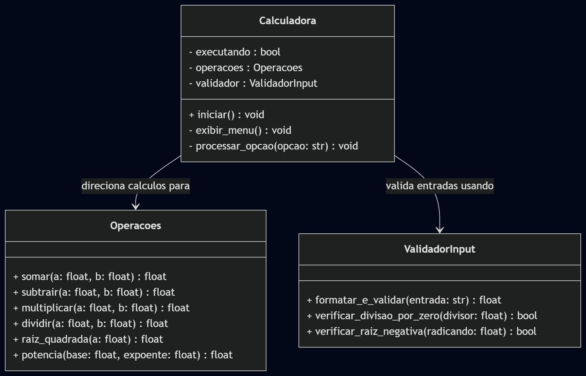

# Diagrama de Classes - Calculadora no Terminal

Este documento apresenta a modelagem estática do sistema, detalhando as classes, seus atributos, métodos e associações.

---

## Modelagem UML

O diagrama abaixo foi estruturado para refletir fielmente os requisitos das User Stories, separando as responsabilidades de controle de fluxo, execução de operações matemáticas e validação de dados de entrada.

---

## Descrição das Componentes

* **Calculadora:** Gerencia o ciclo de vida do programa, controlando o loop principal de execução e a interface de menu no terminal.
* **Operacoes:** Centraliza a lógica matemática de todas as operações (soma, subtração, multiplicação, divisão, potência e raiz).
* **ValidadorInput:** Garante a robustez do sistema, convertendo entradas com vírgulas ou pontos, além de prevenir falhas críticas como divisões por zero e raízes negativas.